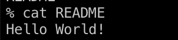
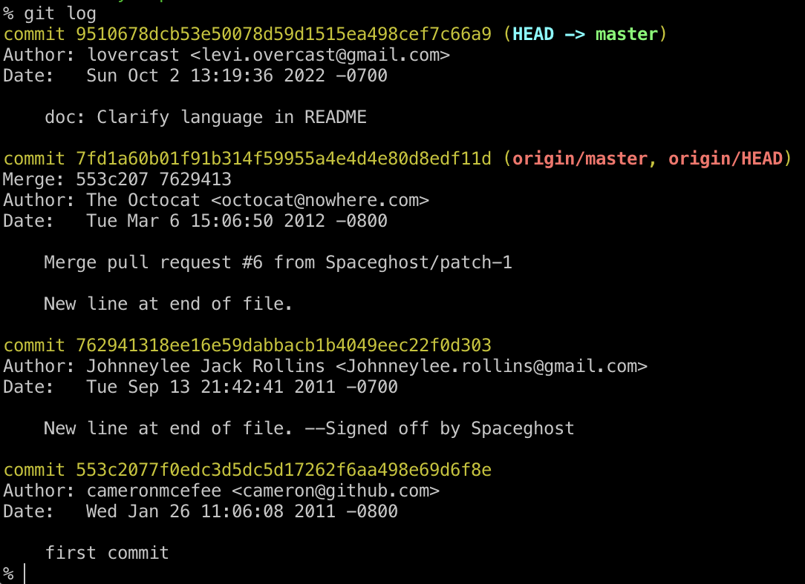

# A Short Git Tour
Let's start by getting a copy of a repo we want to work on.

## Clones
Go to the home page of a repo on Github, for example the [Hello-World](https://github.com/octocat/Hello-World) repo. Click on the green `Code` button and then `HTTPS` and copy the URL. Then at the terminal,

```sh
git clone https://github.com/octocat/Hello-World.git
cd Hello-World
```

Put your name and email on your commits:

```sh
git config --global user.name <your-username>
git config --global user.email <your-email>
```

Be sure that these are the same as the name and email that Github knows about.

## First Commit

A commit tells the story of a change you made.
Let's make a change to this repo.

```sh
echo "This is my repo now haha" > README
cat README
```



Now what's the status of our tree?


It's modified. So we'll have to decide whether to add our changes.
I think this is a good change. Let's make it a part of the tree.

```sh
git add README
```

 

```
git commit -m 'doc: Clarify language in README'
```


## The story so far

Let's look at our commit:

```sh
git show
```

We can look at all the commits leading up to ours:

```sh
git log
```



Ok but I don't like that. It somehow feels both extremely verbose and also void of content.

Let's simplify it:

```sh
git log --all --oneline --graph
```

That's much nicer. But it would be a pain to type every time:

```sh
git config --global alias.tree log --all --oneline --graph
git tree
```


We can see our commit at the top. We can even see branches that aren't part of the main branch like `origin/octocat-patch-1`.

## Branches and branches
Let's make a change but have it not affect our main branch.

```sh
git checkout -b foo
```


I want to use this repo to house a shell script that will output hex numbers that look like English words like `0xBEEF`. 

Let's add that change now:

```sh
echo "#!/bin/sh" > hexfoo
echo 'grep -E "^[a-fA-FoOiIsS]+$" /usr/share/dict/words | tr "[:lower:]" "[:upper:]" | tr "OIS" "015"' >> hexfoo
chmod +x hexfoo
./hexfoo
```

Now we can compose so much great hex poetry for our code snippets:

```c
long foo[] = {
	0xB0B5, 0xAC1D1C, 0xDEADBEEF, 0xC0C0A, 0xC0FFEE, 0xCAFE,
};
```

Let's definitely commit this.


## Add a branch back into the main story

Now that we've added a feature let's add it to the main branch.

```sh
git switch master
git merge --no-ff foo    # This will open an editor. Save and quit to accept the merge.
git tree
```


## Publishing our tree

We want to host our branch on Github so the world can benefit from it. Let's see what our upstream branches are.

```sh
git remote
```

We only have one. It's called `origin`. Where does that point?

```sh
git remote get-url origin
```


That'll never do. We don't want to push changes to `octocat`'s Github. 

I guess we need to make a page on Github to host our tree.  

On Github, create a repository to host the tree. 

Click `Repositories > New`


Click `Add a README`  so we have some conflicts to resolve.

Then on the homepage, get the URL by selecting `Code > HTTPS`  again.

At the terminal:

```sh
git remote set-url origin https://github.com/<your-name>/Hello-World.git
```

Let's check our status against the branch on Github to see if everything's square:

```sh
git fetch
```


Hmm the branch names are different (master is called main on Github) and Github doesn't know about our changes. Let's try and combine them.

We could push now but that would create a branch called `master` on Github instead of updating the main branch.

Let's tell git that we want to push specifically onto `origin/main`

```sh
git push --set-upstream origin main
```


Hmm. Let's rename the branch so that conflict is resolved how do we do that? Let's search the `man` page for rename.

```sh
git help branch
```

On the `man` page you can search for "rename" by typing `/rename`

The first thing that comes up is fairly helpful.


We can search `/-m` until we find an example usage like the one at the top of the page.

```sh
git branch (-m | -M) [<oldbranch>] <newbranch>
```

So `<oldbranch>` is optional. We can enter:

```sh
git branch          # verify that we're on master
git branch -m main
git push --set-upstream origin main
```

Now we can finally push:


Hmm. This is getting a little tedious.

I don't care so much about the README on Github. I'm comfortable overwriting it.

```sh
git push --force --set-upstream origin main
```


In future I can just run

```sh
git push
```

to update main as long as the branches are in sync.


# The End

That was the tour. I hope it gave you a taste of an effective git workflow. You'll learn lots more just using it.

## More Topics

- Add SSH keys to github so you can pull and push private branches
- `git rebase` to move a branch forward in time.
- `git cherry-pick` to replay one commit on top of a branch.
- `git add -i` interactively add hunks of text
